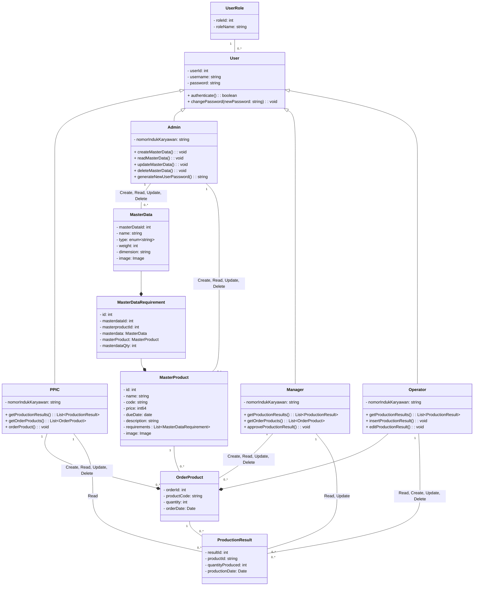

### The Class Diagram

```mermaid
classDiagram
    class User {
        - userId: int
        - username: string
        - password: string
        + authenticate(): boolean
        + changePassword(newPassword: string): void
    }

    class Admin {
        - nomorIndukKaryawan: string
        + createMasterData(): void
        + readMasterData(): void
        + updateMasterData(): void
        + deleteMasterData(): void
        + generateNewUserPassword(): string
    }

    class PPIC {
        - nomorIndukKaryawan: string
        + getProductionResults(): List~ProductionResult~
        + getOrderProducts(): List~OrderProduct~
        + orderProduct(): void
    }

    class Manager {
        - nomorIndukKaryawan: string
        + getProductionResults(): List~ProductionResult~
        + getOrderProducts(): List~OrderProduct~
        + approveProductionResult(): void
    }
    
    class Operator {
        - nomorIndukKaryawan: string
        + getProductionResults(): List~ProductionResult~
        + insertProductionResult(): void
        + editProductionResult(): void
    }

    class UserRole {
        - roleId: int
        - roleName: string
    }

    class MasterData {
        - masterDataId: int
        - name: string
        - type: enum~string~
        - weight: int
        - dimension: string
        - image: Image
    }

    class MasterProduct {
        - id: int
        - name: string
        - code: string
        - price: int64
        - dueDate: date
        - description: string
        - requirements : List~MasterDataRequirement~
        - image: Image
    }
    
    class MasterDataRequirement {
        - id: int
        - masterdataId: int
        - masterproductId: int
        - masterdata: MasterData
        - masterProduct: MasterProduct
        - masterdataQty: int 
    }
    
    class OrderProduct {
        - orderId: int
        - productCode: string
        - quantity: int
        - orderDate: Date
    }

    class ProductionResult {
        - resultId: int
        - productId: string
        - quantityProduced: int
        - productionDate: Date
    }


    MasterDataRequirement --*  MasterProduct
    MasterData --* MasterDataRequirement
    
    UserRole "1" -- "0..*" User
    
    User <|-- PPIC
    User <|-- Admin
    User <|-- Manager
    User <|-- Operator

    PPIC "1" --* "0..*" OrderProduct : Create, Read, Update, Delete
    Operator --* OrderProduct
    PPIC "1" -- "0..*" ProductionResult : Read
    Manager "1" -- "0..*" OrderProduct : Create, Read, Update, Delete
    Manager "1" -- "0..*" ProductionResult : Read, Update
    Operator "1" -- "0..*" ProductionResult : Read, Create, Update, Delete
    Admin "1" -- "0..*" MasterData: Create, Read, Update, Delete
    Admin "1" -- "0..*" MasterProduct: Create, Read, Update, Delete
    
    MasterProduct "1" -- "0..*" OrderProduct
    OrderProduct "1" -- "0..*" ProductionResult
```